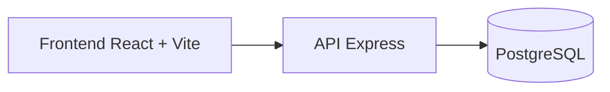

# 🐾 ResgatePet

Sistema para cadastrar pets resgatados, registrar lares temporários e conectar pessoas dispostas a ajudar em situações de emergência.

## Visão geral

O ResgatePet nasce como uma solução prática para organizar a ajuda durante e após desastres naturais, como enchentes e tragédias climáticas. Em momentos de caos, a falta de informação e a ausência de um canal centralizado dificultam o resgate e o acolhimento de animais abandonados ou deslocados.

Este projeto busca facilitar o cadastro de:

- pessoas voluntárias e apoiadoras;
- animais resgatados ou perdidos;
- lares temporários disponíveis para acolhimento.

## Problema que o projeto resolve

Quando ocorrem enchentes ou desastres, muitos animais ficam desorientados, separados de suas famílias e sem local seguro para ficar. A falta de organização faz com que a comunicação entre resgatadores, voluntários e abrigo temporário seja lenta e ineficiente.

O ResgatePet ajuda a centralizar esses dados em um sistema simples, acessível e funcional, permitindo que a rede de apoio se mobilize com mais rapidez.

## Funcionalidades

- cadastro de usuários;
- cadastro de pets com nome, espécie, status, localização, descrição e foto;
- listagem de animais cadastrados;
- cadastro de lares temporários;
- visualização dos dados em interface intuitiva;
- integração entre frontend, backend e banco de dados.

## Arquitetura do projeto



### Frontend

O frontend foi desenvolvido em React com Vite e apresenta uma interface visual para os usuários cadastrarem dados e consultarem os animais disponíveis.

Principais telas:

- Home
- Cadastro de usuário
- Cadastro de pet
- Lista de pets
- Cadastro de lar temporário

### Backend

A API foi construída com Node.js e Express e expõe rotas para manipular usuários, pets e lares temporários.

### Banco de dados

O sistema utiliza PostgreSQL para armazenar as informações de forma estruturada e relacional.

## Tecnologias utilizadas

### Frontend

- React
- Vite
- React Router DOM
- Axios
- React Icons
- CSS moderno para a interface

### Backend

- Node.js
- Express
- PostgreSQL driver (`pg`)
- CORS
- Dotenv

### Infraestrutura

- Render para backend
- Vercel para frontend
- Supabase para banco de dados

## Estrutura do repositório

```bash
ResgatePet/
├── README.md
├── banco/
│   ├── lares_temporarios.sql
│   ├── pets.sql
│   └── usuarios.sql
├── resgate-pet-backend/
│   ├── package.json
│   └── src/
│       ├── app.js
│       ├── server.js
│       ├── config/
│       │   └── db.js
│       └── routes/
│           ├── larestemporarios.js
│           ├── pets.js
│           └── usuarios.js
└── resgate-pet-frontend/
    ├── package.json
    ├── index.html
    ├── vite.config.js
    ├── public/
    └── src/
        ├── App.css
        ├── App.jsx
        ├── index.css
        ├── main.jsx
        ├── assets/
        ├── components/
        │   ├── Navbar.jsx
        │   └── PetCard.jsx
        ├── pages/
        │   ├── CadastroLar.jsx
        │   ├── CadastroPet.jsx
        │   ├── CadastroUsuario.jsx
        │   ├── Home.jsx
        │   └── ListaPets.jsx
        └── services/
            └── api.jsx
```

## Como rodar o projeto localmente

### 1. Clone o repositório

```bash
git clone https://github.com/KarinaSudati/Resgate-Pet.git
cd Resgate-Pet
```

### 2. Configure o backend

```bash
cd resgate-pet-backend
npm install
```

Crie um arquivo `.env` na pasta `resgate-pet-backend` com as variáveis do banco de dados, por exemplo:

```env
DB_HOST=localhost
DB_PORT=5432
DB_USER=postgres
DB_PASSWORD=sua_senha
DB_NAME=resgatepet
```

Inicie o servidor:

```bash
npm run dev
```

### 3. Configure o frontend

```bash
cd ../resgate-pet-frontend
npm install
npm run dev
```

A aplicação frontend ficará disponível no Vite localmente, normalmente em:

```bash
http://localhost:5173
```

## Endpoints principais da API

A API expõe rotas relacionadas a usuários, pets e lares temporários:

- `GET /usuarios`
- `POST /usuarios`
- `PUT /usuarios/:id`
- `DELETE /usuarios/:id`
- `GET /pets`
- `POST /pets`
- `PUT /pets/:id`
- `DELETE /pets/:id`
- `GET /lares-temporarios`
- `POST /lares-temporarios`
- `PUT /lares-temporarios/:id`
- `DELETE /lares-temporarios/:id`

## Estrutura do banco

### Tabela `usuarios`

- id
- nome
- whatsapp
- email
- data_criacao

### Tabela `pets`

- id
- usuario_id
- nome_pet
- especie
- status
- localizacao
- descricao
- foto_url
- data_postagem

### Tabela `lares_temporarios`

- id
- usuario_id
- capacidade
- especies_aceitas
- observacoes
- disponivel
- data_cadastro

## Deploy

- Backend: Render
- Frontend: Vercel
- Banco: PostgreSQL no Supabase

## Links úteis

- Backend: https://resgate-pet.onrender.com/
- Frontend: https://resgate-pet-two.vercel.app/

## Por que esse projeto importa

Além de ser uma aplicação funcional, o ResgatePet representa uma solução voltada para impacto social. Ele combina:

- pensamento crítico;
- análise de problemas reais;
- organização de dados;
- uso de tecnologia para gerar ajuda concreta.

O objetivo principal não é apenas criar uma aplicação, mas transformar uma ideia em uma ferramenta útil para pessoas e animais em situações vulneráveis.

---

Desenvolvido com dedicação por Karina Sudati. 🚀
